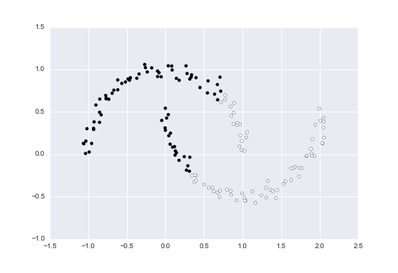
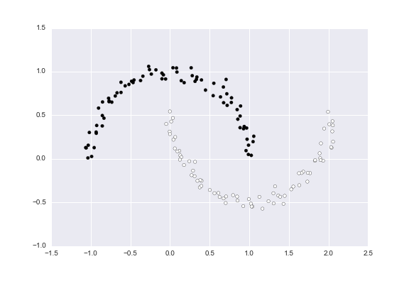

# DBCV
Python implementation of Density-Based Clustering Validation

## Source

Moulavi, Davoud, et al. "Density-based clustering validation." Proceedings of the 2014 SIAM International Conference on Data Mining. Society for Industrial and Applied Mathematics, 2014.

[PDF](http://epubs.siam.org/doi/pdf/10.1137/1.9781611973440.96)

## What is DBCV

How do you validate clustering assignmnets from unsupervised learning algorithms?  A common method is the [Silhoette Method](https://en.wikipedia.org/wiki/Silhouette_(clustering)), which provides an objective score between -1 and 1 on the quality of clustering.  The silhouette value measures how well an object is classified in its own cluster instead of neighboring clusters.  The silhouette (and most other popular methods) work very well on globular clusters, but can fail on non-glubular clusters such as:


Here, we implement DBCV which can validate clustering assignments on non-globular, arbitrarily shaped clusters (such as the example above).  In essence, DBCV computes two values:

* The density **within** a cluster
* The density **between** clusters

High density within a cluster, and low density between clusters indicates good clustering assignments.

## Example

Here, I deliberately picked an example of clusters that density based clustering works well on.

```python
from sklearn import datasets
import matplotlib.pyplot as plt
import seaborn as sns

n_samples=150
noisy_moons = datasets.make_moons(n_samples=n_samples, noise=.05)
X = noisy_moons[0]
plt.scatter(X[:,0], X[:,1])
plt.show()
```


What happens when we try K-means clustering on these non-globular clusters?

```python
from sklearn.cluster import KMeans

kmeans =  KMeans(n_clusters=2)
kmeans_labels = kmeans.fit_predict(X)
plt.scatter(X[:,0], X[:,1], c=kmeans_labels)
plt.show()
```



...Not so great.  What about [HDBSCAN](https://github.com/scikit-learn-contrib/hdbscan), a density based clustering method?

```python
import hdbscan

hdbscanner = hdbscan.HDBSCAN()
hdbscan_labels = hdbscanner.fit_predict(X)
plt.scatter(X[:,0], X[:,1], c=hdbscan_labels)
```



That's pretty good.  To assess the quality of clustering, using Density-Based Clustering Validation, we call `DBCV`

```python
from scipy.spatial.distance import euclidean

kmeans_score = DBCV(X, kmeans_labels, dist_function=euclidean)
hdbscan_score = DBCV(X, hdbscan_labels, dist_function=euclidean)
print(kmeans_score, hdbscan_score)
```

K means returns a DBCV score of **-0.71**, and HDBSCAN returns a score of **0.60**.  
